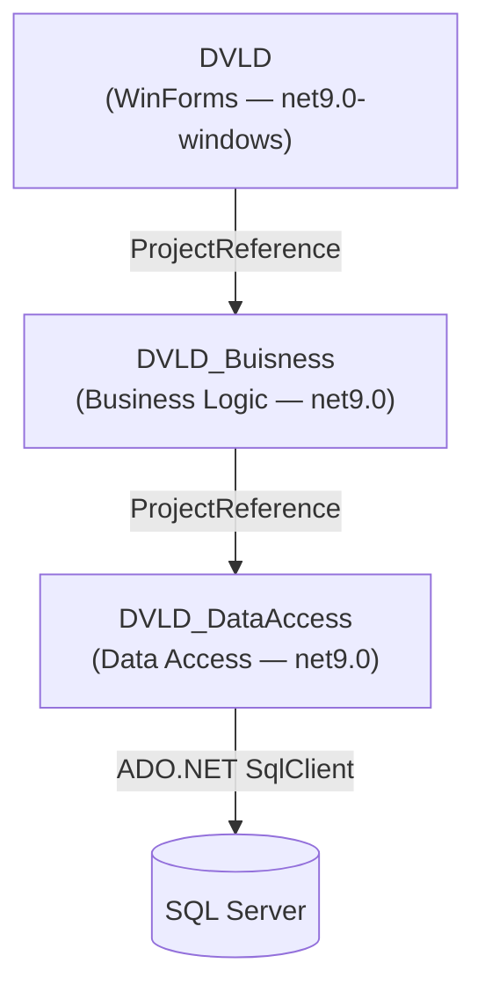

# Architecture

This document describes the actual architecture of the DVLD application as verified from the source code.

---

## Architectural Overview

DVLD is a **three-tier desktop application** using a strict layered architecture:

```
┌────────────────────────────────────────────────┐
│  DVLD  (Presentation / WinForms UI)            │
│  net9.0-windows · WinExe                       │
└───────────────────┬────────────────────────────┘
                    │ ProjectReference
┌───────────────────▼────────────────────────────┐
│  DVLD_Buisness  (Business Logic Layer)         │
│  net9.0 · Class Library                        │
└───────────────────┬────────────────────────────┘
                    │ ProjectReference
┌───────────────────▼────────────────────────────┐
│  DVLD_DataAccess  (Data Access Layer)          │
│  net9.0 · Class Library                        │
│  Microsoft.Data.SqlClient 6.0.3                │
└───────────────────┬────────────────────────────┘
                    │ ADO.NET (SqlConnection / SqlCommand)
┌───────────────────▼────────────────────────────┐
│  SQL Server  (external database)               │
└────────────────────────────────────────────────┘
```

The UI layer references only the Business layer. The Business layer references only the Data Access layer. The Data Access layer communicates directly with SQL Server using ADO.NET.

No layer skipping is present in the codebase.

---

## Dependency Flow (Mermaid)



---

## Layer Responsibilities

### DVLD — Presentation Layer

**Target framework:** `net9.0-windows`
**Output type:** `WinExe`

Responsibilities:
- All Windows Forms windows (`frm*`) and user controls (`ctrl*`)
- Application entry point (`Program.cs`) — configures High DPI mode, enables visual styles, and launches `frmLogin`
- Global state management via `clsGlobal` — stores the currently logged-in `clsUser` object and handles the Remember-Me file (`data.txt`)
- Form-to-form navigation — forms are launched using `ShowDialog()` from menu items or other forms
- Consumes the Business layer exclusively; no direct data access calls from forms

Key directories within `DVLD/`:

| Directory | Contents |
|---|---|
| `Login/` | Login form (`frmLogin`) |
| `User/` | User list, add/update user, change password, user card, user info |
| `People/` | Person list, add/update person, find person, person info, person card controls |
| `Drivers/` | Driver list form |
| `Licenses/` | Local licenses, international licenses, detained license forms, person license history |
| `Applications/` | Application type management, local DL application forms, international license application, renew, replace lost/damaged, release detained |
| `Tests/` | Test appointment list, schedule test, take test, test type management |
| `Global Classes/` | `clsGlobal` (session state, remember-me), utility class |
| `Resources/` | Embedded resources |
| `Properties/` | Application properties |

---

### DVLD_Buisness — Business Logic Layer

**Target framework:** `net9.0`
**Output type:** Class Library

Responsibilities:
- Defines all business entities as C# classes (`cls*`)
- Implements business rules (e.g., test prerequisite enforcement, license issuance workflow, application status transitions)
- Each class exposes static `Find*` / `GetAll*` methods and an instance `Save()` method that delegates to the Data Access layer
- Uses a `Mode` enum (`AddNew` / `Update`) on each class to control whether `Save()` inserts or updates
- No direct SQL or ADO.NET usage — communicates only with `DVLD_DataAccess`

Key business classes:

| Class | Responsibility |
|---|---|
| `clsUser` | System user entity; find by ID, username+password; save |
| `clsPerson` | Person entity; find by ID or national number; CRUD |
| `clsDriver` | Driver entity; linked to a `clsPerson`; created when a license is first issued |
| `clsApplication` | Base application entity; application types, statuses, fees |
| `clsLocalDrivingLicenseApplication` | Extends `clsApplication`; manages local DL application workflow including test prerequisite checks and license issuance |
| `clsLicense` | Local driving license entity; supports issue, renew, replace, detain, release |
| `clsInternationalLicense` | Extends `clsApplication`; international license issued based on an existing local license |
| `clsDetainedLicense` | Detained license record; detain and release operations |
| `clsTestType` | Test type entity (VisionTest=1, WrittenTest=2, StreetTest=3) |
| `clsTest` | Individual test result record |
| `clsTestAppointment` | Scheduled test appointment |
| `clsLicenseClass` | License class entity (class name, minimum age, validity, fees) |
| `clsApplicationType` | Application type entity (name, fees) |
| `clsCountry` | Country lookup for nationality |

---

### DVLD_DataAccess — Data Access Layer

**Target framework:** `net9.0`
**Output type:** Class Library
**External package:** `Microsoft.Data.SqlClient` 6.0.3

Responsibilities:
- All SQL Server communication using ADO.NET
- Resolves the connection string via `clsDataAccessSettings` (environment variable → dvld.env file → fail-fast exception)
- Each data class (`cls*Data`) contains static methods that open a `SqlConnection`, build a parameterized `SqlCommand`, execute it, and map the results
- Returns primitive values, `DataTable`, or boolean success indicators to the Business layer
- Does not return raw ADO.NET objects (`SqlDataReader`, `SqlConnection`) to callers

Key data access classes:

| Class | Database entity |
|---|---|
| `clsUserData` | `Users` table |
| `clsPersonData` | `People` table, `Countries` table (join) |
| `clsDriverData` | `Drivers` table |
| `clsApplicationData` | `Applications` table |
| `clsLocalDrivingLicenseApplicationData` | `LocalDrivingLicenseApplications` table |
| `clsLicenseData` | `Licenses` table |
| `clsInternationalLicenseData` | `InternationalLicenses` table |
| `clsDetainedLicenseData` | `DetainedLicenses` table, `detainedLicenses_View` view |
| `clsTestTypeData` | `TestTypes` table |
| `clsTestData` | `Tests` table |
| `clsTestAppointmentData` | `TestAppointments` table |
| `clsLicenseClassData` (`LicenseClass.cs`) | `LicenseClasses` table |
| `clsApplicationTypeData` (`ApplicationType.cs`) | `ApplicationTypes` table |
| `clsCountryData` | `Countries` table |
| `clsDataAccessSettings` | Connection string resolver (no database table) |

---

## Important Design Decisions

The following design decisions are observed in the actual source code:

### Active Record / Repository Hybrid
Business classes contain both data properties and methods (`Save()`, `Find()`, `Delete()`). This is an Active Record–style pattern. There is no separate repository interface layer.

### Mode-Based Save
Every business entity class contains a `Mode` field (`enMode.AddNew` or `enMode.Update`). The `Save()` method branches on this mode to call either `AddNew*` or `Update*` in the Data Access layer.

### Static Finder Methods
All lookup operations are implemented as `static` methods on business classes (`clsUser.FindByUsernameAndPassword(...)`, `clsLicense.Find(int LicenseID)`, etc.).

### Inheritance for Sub-Applications
`clsLocalDrivingLicenseApplication` and `clsInternationalLicense` both extend `clsApplication`. When `Save()` is called on a sub-application, it first saves the base `Applications` record, then saves the sub-application record.

### No Dependency Injection
There is no DI container. All dependencies are resolved directly by calling static methods or instantiating objects directly.

### No Repository Interface Abstraction
There are no interface types for repositories. The Business layer calls static methods on concrete Data Access classes.

### No ORM
All database access uses raw ADO.NET (`SqlConnection`, `SqlCommand`, `SqlDataReader`, `ExecuteScalar`, `ExecuteNonQuery`). There is no Entity Framework or other ORM.

### Parameterized SQL Throughout
All SQL queries use `Parameters.AddWithValue(...)` to prevent SQL injection. No dynamic SQL string concatenation is used to embed user input.

### Fail-Fast Connection String Resolution
`clsDataAccessSettings.ConnectionString` throws an `InvalidOperationException` at first access if neither `DVLD_CONNECTION_STRING` nor `dvld.env` is available. This ensures misconfiguration is immediately visible.
